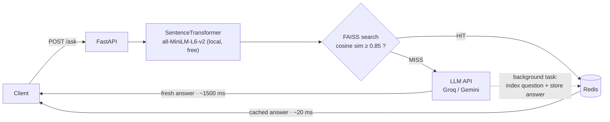

# ⚡ Semantic Caching Layer for LLMs

A production-style caching layer that sits in front of any LLM API and serves **semantically similar questions straight from cache** — cutting response latency from seconds to milliseconds and eliminating redundant, billable LLM calls.


## 💡 The Problem

LLM APIs are **slow** (often 1–3 s per call) and **billed per token**. Yet in real products — support bots, FAQ assistants, internal knowledge tools — a large share of incoming questions are *rephrasings of questions already answered*:

> "What is the capital of France?" ≈ "Which city is France's capital?"

A classic key-value cache misses these because the strings differ. This project catches them by comparing **meaning**, not text.

## 🏗️ Architecture



**Request lifecycle:**

1. The incoming question is embedded **locally** with `sentence-transformers` (`all-MiniLM-L6-v2`, 384-dim) — no API call, no cost.
2. **FAISS** runs a nearest-neighbor search over all previously seen questions (inner product on normalized vectors = exact cosine similarity).
3. **Cache HIT** (similarity ≥ configurable threshold): the stored answer is returned directly from **Redis**. No LLM call, no cost, ~20 ms.
4. **Cache MISS**: the LLM (Groq or Gemini, free tier) is called, the answer is returned immediately, and the `(question, answer)` pair is indexed **in the background** — cache writes never block the user's response.
5. Every request updates hit/miss counters and latency accumulators in Redis, exposed via `GET /stats`.

## 📊 Impact — Measured Results

Real numbers from `python benchmark.py` (Groq · `llama-3.1-8b-instant` · local Windows machine):

```
SOURCE      LATENCY   QUESTION
--------------------------------------------------------------------------------
llm         373.7 ms  Quelle est la capitale de la France ?
cache        51.7 ms  Quelle est la capitale de la France ?  (similarity: 1.0)
cache        53.9 ms  C'est quoi la capitale de la France ?  (similarity: 0.8996)
llm         331.7 ms  Peux-tu me dire quelle ville est la capitale française ?
llm         223.4 ms  Quelle est la capitale de l'Allemagne ?
```

| Path | Avg latency (measured) | Cost per request |
|------|-----------------------:|-----------------:|
| Cache MISS (Groq API call) | ~302 ms | $0.01 (simulated) |
| Cache HIT (FAISS + Redis)  | **~44 ms** | **$0.00** |

→ **~7× faster on hits** — even against Groq, one of the fastest LLM APIs available. Against mainstream APIs (GPT-4-class or Gemini, typically 1–3 s per call), the same hit path is **20–60× faster**. On a workload where 60% of questions are rephrasings, this layer eliminates ~60% of API spend.

## 🚀 Quickstart

### Option A — Docker (one command)

```bash
cp .env.example .env       # paste your free Groq or Gemini API key
docker compose up --build
```

API at <http://localhost:8000> · interactive docs at `/docs`.

### Option B — Manual setup

### 1. Prerequisites

- Python 3.10+
- A free API key from [Groq](https://console.groq.com/keys) **or** [Google AI Studio](https://aistudio.google.com/apikey)
- Redis — easiest via Docker:

```bash
docker run -d --name redis -p 6379:6379 redis:7
```

*(No Docker? On Windows use [Memurai](https://www.memurai.com/) or WSL: `sudo apt install redis-server && sudo service redis-server start`.)*

### 2. Install

```bash
git clone https://github.com/houas-sarah/semantic-caching-layer.git
cd semantic-caching-layer

python -m venv venv
# Windows :
venv\Scripts\activate
# Linux / macOS :
source venv/bin/activate

pip install -r requirements.txt
```

### 3. Configure

```bash
cp .env.example .env   # then paste your API key into .env
```

### 4. Run

```bash
uvicorn main:app --reload
```

The first startup downloads the embedding model (~90 MB, one time only). Interactive API docs: <http://localhost:8000/docs>

### 5. Try it

```bash
# First call → MISS (hits the LLM)
curl -X POST http://localhost:8000/ask \
     -H "Content-Type: application/json" \
     -d '{"question": "What is the capital of France?"}'

# Rephrased → HIT (served from cache in milliseconds)
curl -X POST http://localhost:8000/ask \
     -H "Content-Type: application/json" \
     -d '{"question": "Which city is the capital of France?"}'

curl http://localhost:8000/stats
```

Or run the full demo: `python benchmark.py`

## 📡 API Reference

| Method | Endpoint  | Description |
|--------|-----------|-------------|
| POST   | `/ask`    | Answer a question (semantic cache first, LLM fallback) |
| GET    | `/stats`  | Hit rate, estimated $ saved, average latencies |
| GET    | `/health` | API + Redis health check |
| DELETE | `/cache`  | Flush the whole cache (FAISS + Redis + stats) |

**`POST /ask` — cache hit response:**

```json
{
  "source": "cache",
  "answer": "La capitale de la France est Paris.",
  "matched_question": "Quelle est la capitale de la France ?",
  "similarity": 0.8996,
  "latency_ms": 43.6
}
```

**`GET /stats` response:**

```json
{
  "total_requests": 42,
  "cache_hits": 25,
  "cache_misses": 17,
  "hit_rate": 0.5952,
  "estimated_savings_usd": 0.25,
  "avg_latency_ms_cache_hit": 21.3,
  "avg_latency_ms_llm_call": 1418.7,
  "cached_entries": 17,
  "similarity_threshold": 0.85
}
```

## ✅ Tests

```bash
pytest tests -q
```

The 8 tests cover embedding normalization, hit/miss logic, threshold behavior, resilience to Redis eviction, stats tracking, and FAISS persistence across restarts. They run against a dedicated Redis DB and a temporary index — live cache data is never touched.

## ⚙️ Configuration

All settings live in `config.py` and can be overridden via `.env`:

| Variable | Default | Description |
|----------|---------|-------------|
| `LLM_PROVIDER` | `groq` | `groq` or `gemini` |
| `SIMILARITY_THRESHOLD` | `0.85` | Min cosine similarity for a cache hit |
| `EMBEDDING_MODEL` | `all-MiniLM-L6-v2` | Any sentence-transformers model |
| `REDIS_HOST` / `REDIS_PORT` | `localhost` / `6379` | Redis connection |
| `COST_PER_LLM_CALL_USD` | `0.01` | Simulated cost used by `/stats` |

**Tuning the threshold:** higher (0.90+) = stricter matching, fewer hits but near-zero risk of serving an off-topic answer; lower (0.80) = more hits, more risk. `0.85` is a good starting point for MiniLM.

Real data points from this project — a close paraphrase ("C'est quoi la capitale de la France ?") scores **0.90** against the original, while a longer, more indirect one ("Peux-tu me dire quelle ville est la capitale française ?") drops to **0.79**. This is the classic precision/recall trade-off: at 0.85 the second phrasing triggers a (safe) LLM call instead of a cache hit.

### Threshold evaluation on real data

`python evaluate_threshold.py` sweeps the threshold over 4,000 sampled pairs from the **Quora Question Pairs** dataset (404k human-labeled question pairs). Measured results:

| Threshold | Precision | Recall | F1 |
|----------:|----------:|-------:|------:|
| 0.70 | 0.726 | 0.942 | 0.820 |
| 0.75 | 0.757 | 0.878 | 0.813 |
| 0.80 | 0.792 | 0.761 | 0.776 |
| **0.85 (default)** | **0.838** | **0.612** | 0.707 |
| 0.90 | 0.879 | 0.430 | 0.578 |
| 0.95 | 0.925 | 0.214 | 0.348 |

How to read this for a *cache*: a **false positive serves a wrong answer to the user**, while a false negative merely costs one extra LLM call — so precision matters far more than recall or F1 (which peaks at 0.70). At the default `0.85`, the cache still captures 61% of true duplicates while keeping wrong answers in check. Two caveats worth knowing: Quora's "non-duplicates" are *hard negatives* (closely related questions), so real-world precision — where most distinct questions are entirely unrelated — runs substantially higher than these figures; and raising the threshold (or swapping in a stronger embedding model) is the lever if your domain punishes wrong answers severely.

## 🧠 Design Decisions

- **Cosine similarity via `IndexFlatIP` + normalized embeddings** — exact (not approximate) search, and the score is directly interpretable as similarity in [0, 1].
- **`IndexIDMap` with Redis-issued IDs** — FAISS vector IDs and Redis keys stay in sync across restarts; the FAISS index is persisted to disk after each insert.
- **Write-behind caching** — new entries are stored via FastAPI `BackgroundTasks`, *after* the response is sent. A cache miss is never slower than a raw LLM call.
- **Stats live in Redis** — hit rate and savings survive application restarts.
- **Local embeddings** — the similarity check itself costs $0 and adds only ~10 ms, so the cache layer can never increase your API bill.

## 📁 Project Structure

```
.
├── main.py                 # FastAPI app: /ask, /stats, /health, DELETE /cache
├── cache.py                # SemanticCache: embeddings + FAISS + Redis + stats
├── llm.py                  # LLM client (Groq / Gemini), called only on cache miss
├── config.py               # Centralized settings (overridable via .env)
├── benchmark.py            # Demo script showing HIT vs MISS latency
├── evaluate_threshold.py   # Precision/recall threshold sweep on Quora Question Pairs
├── tests/                  # pytest suite (isolated Redis DB + temp FAISS index)
├── Dockerfile
├── docker-compose.yml
├── requirements.txt
├── .env.example
└── README.md
```

## 🔭 Possible Extensions

- TTL / eviction policy for stale answers (`EXPIRE` in Redis + periodic FAISS rebuild)
- Per-user or per-tenant cache namespaces
- Swap `IndexFlatIP` for `IndexHNSWFlat` beyond ~1M cached entries
- A/B logging of near-threshold matches to auto-tune the similarity threshold

## 📄 License

MIT
